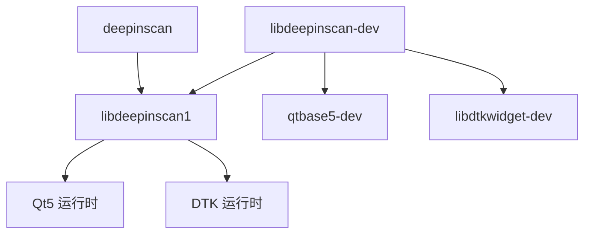

# DeepinScan Debian 打包指南

本文档详细介绍了 DeepinScan 项目的 Debian 包构建、分发和维护过程。

## 📋 目录

- [包结构概述](#包结构概述)
- [构建环境准备](#构建环境准备)
- [构建流程](#构建流程)
- [包文件分析](#包文件分析)
- [分发和安装](#分发和安装)
- [维护和更新](#维护和更新)
- [故障排除](#故障排除)

## 📦 包结构概述

DeepinScan 采用标准的 Debian 多包架构，遵循 Debian Policy Manual：

```
deepinscan (源码包)
├── deepinscan              # 主应用程序包
├── libdeepinscan1          # 运行时库包
├── libdeepinscan-dev       # 开发包
├── deepinscan-dbgsym       # 调试符号包
└── libdeepinscan1-dbgsym   # 库调试符号包
```

### 包依赖关系



## 🛠️ 构建环境准备

### 系统要求
- **操作系统**: Debian 10+ / Ubuntu 18.04+ / Deepin 20.8+
- **架构**: amd64 (其他架构需要交叉编译)

### 安装构建依赖
```bash
# 基础构建工具
sudo apt-get update
sudo apt-get install build-essential devscripts debhelper

# 项目特定依赖
sudo apt-get install cmake pkg-config qtbase5-dev qttools5-dev \
                     libdtkcore-dev libdtkwidget-dev libdtkgui-dev \
                     libusb-1.0-0-dev libsane-dev

# 可选：文档生成
sudo apt-get install doxygen graphviz
```

### 验证环境
```bash
# 检查关键工具版本
cmake --version          # >= 3.16
dpkg-buildpackage --version
debhelper --version      # >= 9

# 检查 Qt 和 DTK
pkg-config --modversion Qt5Core     # >= 5.11
pkg-config --modversion dtkwidget   # >= 5.0
```

## 🏗️ 构建流程

### 1. 准备源码
```bash
git clone https://github.com/eric2023/deepinscan.git
cd deepinscan

# 确保在正确的分支
git checkout main
git pull origin main
```

### 2. 检查 debian/ 目录结构
```bash
tree debian/
```

应该包含：
- `control` - 包描述和依赖关系
- `rules` - 构建规则
- `changelog` - 版本变更日志
- `copyright` - 版权信息
- `compat` - debhelper 兼容性级别
- `*.install` - 各包的文件安装列表

### 3. 执行构建
```bash
# 方式一：使用项目构建脚本（推荐）
./build.sh package

# 方式二：直接使用 dpkg-buildpackage
dpkg-buildpackage -us -uc -b

# 方式三：使用 debuild（如果已安装）
debuild -us -uc -b
```

### 4. 验证构建结果
```bash
# 检查生成的包文件
ls -la ../*.deb

# 验证包内容
dpkg -c ../deepinscan_1.0.0-1_amd64.deb
dpkg -c ../libdeepinscan1_1.0.0-1_amd64.deb

# 检查包依赖
dpkg -I ../deepinscan_1.0.0-1_amd64.deb
```

## 📋 包文件分析

### deepinscan (主应用程序包)
```bash
# 包含文件
/usr/bin/deepinscan              # 主程序（符号链接）
/usr/bin/deepinscan-minimal      # 实际可执行文件
/usr/bin/deepinscan_core_test    # 测试程序
/usr/share/applications/deepinscan.desktop  # 桌面文件

# 依赖关系
Depends: libdeepinscan1 (= ${binary:Version}), ${shlibs:Depends}, ${misc:Depends}
```

### libdeepinscan1 (运行时库包)
```bash
# 包含文件
/usr/lib/libdeepinscan.so.1.0.0  # 主库文件
/usr/lib/libdeepinscan.so.1      # 主版本符号链接

# 依赖关系
Depends: ${shlibs:Depends}, ${misc:Depends}
Multi-Arch: same
```

### libdeepinscan-dev (开发包)
```bash
# 包含文件
/usr/lib/libdeepinscan.so        # 开发符号链接
/usr/include/Scanner/            # 头文件目录
/usr/lib/pkgconfig/deepinscan.pc # pkg-config 文件

# 依赖关系
Depends: libdeepinscan1 (= ${binary:Version}), qtbase5-dev, libdtkwidget-dev
```

## 🚀 分发和安装

### 本地安装测试
```bash
# 安装运行时包
sudo dpkg -i ../libdeepinscan1_1.0.0-1_amd64.deb
sudo dpkg -i ../deepinscan_1.0.0-1_amd64.deb

# 解决可能的依赖问题
sudo apt-get install -f

# 验证安装
deepinscan --version
pkg-config --modversion deepinscan
```

### 创建本地仓库
```bash
# 创建仓库目录
mkdir -p /var/www/html/debian/pool/main
cp ../*.deb /var/www/html/debian/pool/main/

# 生成 Packages 文件
cd /var/www/html/debian
dpkg-scanpackages pool/main /dev/null | gzip -9c > dists/stable/main/binary-amd64/Packages.gz

# 生成 Release 文件
apt-ftparchive release dists/stable > dists/stable/Release
```

### 上传到 PPA 或仓库
```bash
# 准备源码包（如果需要）
debuild -S -sa

# 上传到 Launchpad PPA（示例）
dput ppa:your-ppa ../deepinscan_1.0.0-1_source.changes
```

## 🔄 维护和更新

### 版本更新流程
```bash
# 1. 更新版本号
dch -v 1.0.1-1 "新版本特性和修复"

# 2. 提交更改
git add debian/changelog
git commit -m "debian: bump version to 1.0.1-1"

# 3. 重新构建
./build.sh package

# 4. 测试新包
sudo dpkg -i ../deepinscan_1.0.1-1_amd64.deb
```

### 依赖关系维护
```bash
# 检查运行时依赖
objdump -p /usr/lib/libdeepinscan.so.1.0.0 | grep NEEDED

# 更新 control 文件中的依赖版本
# 检查 shlibs 文件
dpkg-shlibdeps debian/libdeepinscan1/usr/lib/libdeepinscan.so.1.0.0
```

## 🔧 故障排除

### 常见构建错误

#### 1. dh_install: missing files
```bash
# 问题：文件路径不匹配
# 解决：检查实际安装路径
find debian/tmp -name "*.so*"

# 更新 *.install 文件中的路径
```

#### 2. dpkg-shlibdeps: symbol warnings
```bash
# 问题：符号依赖警告
# 这通常是因为私有符号，可以忽略
# 或者添加 symbols 文件来管理
```

#### 3. lintian 警告
```bash
# 运行 lintian 检查
lintian ../*.deb

# 常见警告及解决方案：
# - binary-without-manpage: 添加 man 页面
# - desktop-entry-lacks-icon: 添加图标文件
```

### 调试构建过程
```bash
# 启用详细输出
DH_VERBOSE=1 dpkg-buildpackage -us -uc -b

# 检查临时文件
ls -la debian/tmp/

# 手动运行 dh_install
dh_install --verbose
```

### 依赖问题解决
```bash
# 检查包依赖
apt-cache depends deepinscan

# 强制安装（开发环境）
sudo dpkg -i --force-depends ../deepinscan_1.0.0-1_amd64.deb

# 修复依赖
sudo apt-get install -f
```

## 📖 参考资源

- [Debian Policy Manual](https://www.debian.org/doc/debian-policy/)
- [Debian Maintainer's Guide](https://www.debian.org/doc/manuals/maint-guide/)
- [debhelper Documentation](https://manpages.debian.org/debhelper)
- [Qt Packaging Guidelines](https://qt-project.org/wiki/Packaging)
- [DTK Development Guide](https://github.com/linuxdeepin/dtkwidget)

## 📝 最佳实践

1. **版本控制**: 始终在 git 中管理 debian/ 目录
2. **测试**: 在干净环境中测试包安装和卸载
3. **依赖**: 使用最小必要依赖，避免循环依赖
4. **符号**: 对于库包，考虑提供 symbols 文件
5. **文档**: 保持 changelog 和 README 更新
6. **质量**: 定期运行 lintian 检查包质量

---

**维护者**: DeepinScan Team <deepinscan@deepin.org>  
**最后更新**: 2024-07-21 